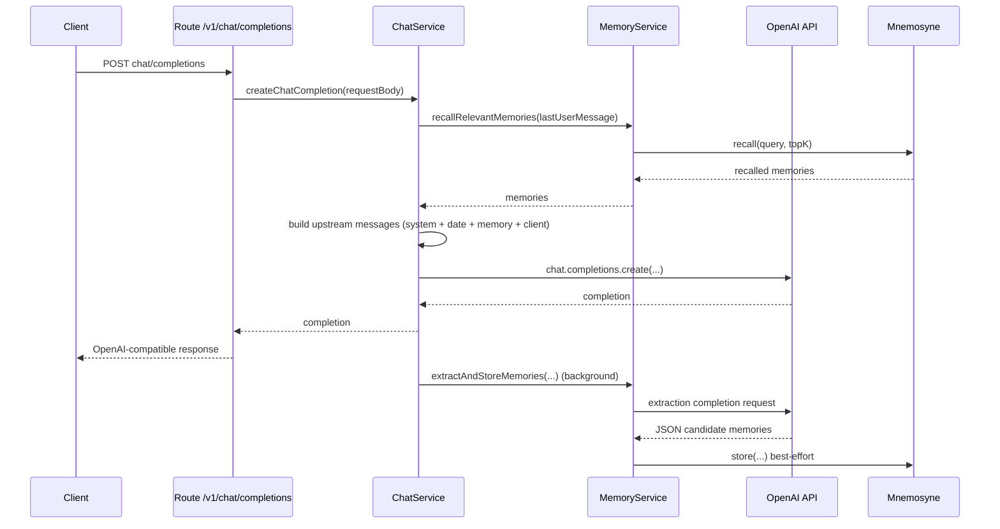

# High-Level Architecture

## Component Map
Sage is structured as an OpenAI-compatible HTTP facade that enriches upstream chat requests with memory context and optional tool execution, while persisting conversation history for memory workflows.

- **App layer (`src/app.js`)**
  - Builds Fastify app.
  - Registers hooks/routes.
  - Normalizes all errors into OpenAI-style payloads.
- **Entry/runtime (`src/index.js`)**
  - Loads config, creates clients/services, starts server, handles shutdown.
- **Hooks (`src/http/hooks/*`)**
  - Auth for `/v1/*` via bearer token.
  - Structured request logging.
- **Routes (`src/http/routes/*`)**
  - Thin endpoints that validate input, delegate to services, and serialize output.
- **Services (`src/services/*`)**
  - `chat-service`: request orchestration, memory retrieval + async memory ingestion, tool loop, upstream calls.
  - `llm-router-service`: local-first LLM routing with cloud fallback policy.
  - `memory-service`: compatibility facade over the layered memory controller.
  - `memory/*`: memory controller + mem0/Zep/Mnemosyne/Redis adapters.
  - `conversation-store`: SQLite persistence for conversation history and extraction metadata.
  - `model-service`: model list cache + availability checks.
  - `prompt-service`: loads active system prompt from YAML.
- **Providers (`src/providers/*`)**
  - `openai-client`: upstream OpenAI SDK client.
  - `mnemosyne-client`: long-term memory backend client.
- **Tools (`src/tools/*`)**
  - Built-in tools: `get_memories`, `add_memory`, `web_search`, `get_url_content`, `read_document_chunk`, `find_in_document`.
  - Document cache for web retrieval handles (`document_id`/`result_id`).
  - MCP adapter/manager for namespaced external tools.
  - Tool executor with timeout and bounded parallelism.

## Startup Flow
Sage startup path in `src/index.js`:
1. Parse and validate environment into normalized config (`createConfig`).
2. Create logger (`createLogger`).
3. Construct providers:
   - OpenAI client
   - Mnemosyne client
4. Construct services:
   - prompt, model, memory, llm router, tool registry/executor, chat
5. Initialize MCP manager (`mcpClientManager.initialize()`).
6. Build Fastify app (`buildApp`) and register routes.
7. Start listening.
8. Attach `SIGINT`/`SIGTERM` graceful shutdown handler.

## Request Lifecycle

## A) Non-stream chat completion
1. Client sends `POST /v1/chat/completions`.
2. Route validates request body (including `conversation_id`/`conversationId`) and extracts normalized fields.
3. `chat-service` verifies model is available.
4. `memory-service` calls the memory controller retrieval pipeline:
   - identity context cache lookup
   - query cache lookup
   - parallel Zep graph + Mnemosyne semantic/episodic retrieval on cache miss
   - token-budgeted context assembly
5. `chat-service` builds upstream message list:
   - Active system prompt
   - Current date system message
   - Memory context system message
   - Client-provided messages
6. If tools are active, execute bounded tool loop; otherwise direct upstream completion.
7. Return OpenAI-compatible completion JSON.
8. Append assistant reply to conversation store.
9. Schedule best-effort async memory ingestion for final assistant text.

## B) Stream chat completion
1. Same validation/model check/memory retrieval/upstream payload build.
2. If tools are active, run native multi-round streaming tool loop:
   - forward upstream chunks (including `tool_calls` deltas),
   - execute server-side tool calls between rounds,
   - continue streaming subsequent assistant rounds.
3. If tools are not active, forward upstream streaming completion directly.
4. Send `[DONE]` terminator.
5. Append streamed assistant reply to conversation store.
6. Trigger post-stream async memory ingestion using final assembled assistant text only.

## C) Non-stream tool loop
1. Model returns assistant `tool_calls`.
2. `tool-executor` resolves handlers and executes with timeout.
3. Successful handled results are appended as `tool` role messages.
4. Loop repeats until assistant returns normal message or `maxRounds` reached.

## D) Web document-handle workflow
1. `web_search` returns metadata/snippets plus stable `result_id` handles.
2. `get_url_content` resolves `url`/`result_id`, fetches content, and stores normalized full text in server-side cache.
3. Tool response returns `document_id` + preview/metadata (not full body).
4. Model uses `read_document_chunk` and `find_in_document` to progressively read/search cached content.

## Memory Lifecycle
1. **Write phase (`processMessage`)**
   - User and final assistant turns are ingested asynchronously.
   - Turn indexing counts only `user` and `assistant` roles (tool messages are excluded).
   - `messageId = sha256(conversationId|role|turnIndex|normalizedText).hex()` enforces idempotency.
   - mem0 is write-path only and never used for retrieval.
   - Facts are persisted to Mnemosyne, propagated to Zep, and Redis scope cache is invalidated.
2. **Retrieval phase (`retrieveContext`)**
   - Enforced global budget (`SAGE_MEMORY_RETRIEVAL_BUDGET_MS`) and per-adapter timeouts.
   - Identity context (cached separately) is loaded first.
   - Query context uses Zep + Mnemosyne in parallel, with partial results allowed on timeout.
   - Circuit breakers temporarily skip repeatedly failing backends.
   - Empty context is returned on full failure; chat response is never blocked.
3. **Context assembly**
   - Merge priority: identity, graph, semantic, episodic.
   - Token limit enforced with active-model tokenizer (`SAGE_MEMORY_CONTEXT_MAX_TOKENS`).
   - Lower priority memories are truncated first.

## Model Lifecycle
1. `/v1/models` uses `model-service`.
2. Upstream model list is cached for `SAGE_MODEL_CACHE_TTL_MS`.
3. `SAGE_OPENAI_MODEL_ALLOWLIST` filters the visible set.
4. If upstream refresh fails and stale cache exists, stale cache is served.

## Sequence Diagram (Non-stream chat)

