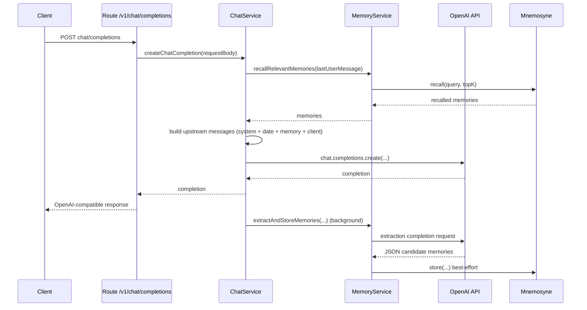

# High-Level Architecture

## Component Map
Sage is structured as a stateless HTTP facade that enriches upstream OpenAI chat requests with memory context and optional tool execution.

- **App layer (`src/app.js`)**
  - Builds Fastify app.
  - Registers hooks/routes.
  - Normalizes all errors into OpenAI-style payloads.
- **Entry/runtime (`src/index.js`)**
  - Loads config, creates clients/services, starts server, handles shutdown.
- **Hooks (`src/http/hooks/*`)**
  - Auth for `/v1/*` via bearer token.
  - Structured request logging.
- **Routes (`src/http/routes/*`)**
  - Thin endpoints that validate input, delegate to services, and serialize output.
- **Services (`src/services/*`)**
  - `chat-service`: request orchestration, memory recall, tool loop, upstream calls.
  - `memory-service`: memory recall, context formatting, extraction/storage.
  - `model-service`: model list cache + availability checks.
  - `prompt-service`: loads active system prompt from YAML.
- **Providers (`src/providers/*`)**
  - `openai-client`: upstream OpenAI SDK client.
  - `mnemosyne-client`: long-term memory backend client.
- **Tools (`src/tools/*`)**
  - Built-in tools: `get_memories`, `add_memory`, `web_search`, `get_url_content`.
  - MCP adapter/manager for namespaced external tools.
  - Tool executor with timeout and bounded parallelism.

## Startup Flow
Sage startup path in `src/index.js`:
1. Parse and validate environment into normalized config (`createConfig`).
2. Create logger (`createLogger`).
3. Construct providers:
   - OpenAI client
   - Mnemosyne client
4. Construct services:
   - prompt, model, memory, tool registry/executor, chat
5. Initialize MCP manager (`mcpClientManager.initialize()`).
6. Build Fastify app (`buildApp`) and register routes.
7. Start listening.
8. Attach `SIGINT`/`SIGTERM` graceful shutdown handler.

## Request Lifecycle

## A) Non-stream chat completion
1. Client sends `POST /v1/chat/completions`.
2. Route validates request body and extracts normalized fields.
3. `chat-service` verifies model is available.
4. `memory-service` recalls relevant memories from latest user message.
5. `chat-service` builds upstream message list:
   - Active system prompt
   - Current date system message
   - Memory context system message
   - Client-provided messages
6. If tools are active, execute bounded tool loop; otherwise direct upstream completion.
7. Return OpenAI-compatible completion JSON.
8. Schedule best-effort background memory extraction/store.

## B) Stream chat completion
1. Same validation/model check/memory recall/upstream payload build.
2. Open upstream streaming completion.
3. Forward chunks as SSE events to client.
4. Send `[DONE]` terminator.
5. Trigger post-stream background memory extraction using collected assistant text.

## C) Non-stream tool loop
1. Model returns assistant `tool_calls`.
2. `tool-executor` resolves handlers and executes with timeout.
3. Successful handled results are appended as `tool` role messages.
4. Loop repeats until assistant returns normal message or `maxRounds` reached.

## D) Stream + tools fallback
If `stream: true` and tools are present, current behavior is:
1. Run non-stream completion path internally.
2. Convert final completion to synthetic stream chunks.
3. Emit SSE chunks and `[DONE]`.

## Memory Lifecycle
1. **Recall phase (pre-generation)**
   - Query: latest user message.
   - Limit: `SAGE_MEMORY_TOP_K`.
2. **Injection phase**
   - Recalled memories transformed into a deterministic memory context block.
   - Added as a system message before user conversation.
3. **Extraction phase (post-generation)**
   - Separate extraction prompt asks model for JSON memories.
   - Parsed and normalized entries are stored best-effort.
   - Failures are logged and do not fail the client response.

## Model Lifecycle
1. `/v1/models` uses `model-service`.
2. Upstream model list is cached for `SAGE_MODEL_CACHE_TTL_MS`.
3. `SAGE_OPENAI_MODEL_ALLOWLIST` filters the visible set.
4. If upstream refresh fails and stale cache exists, stale cache is served.

## Sequence Diagram (Non-stream chat)

